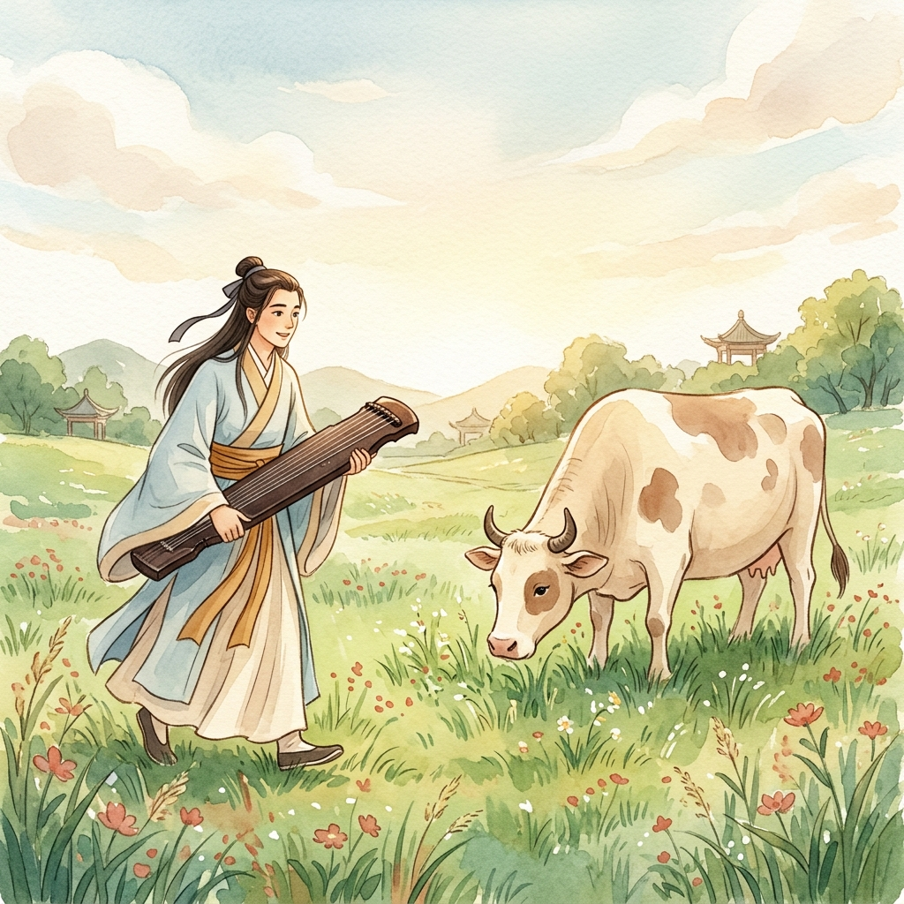
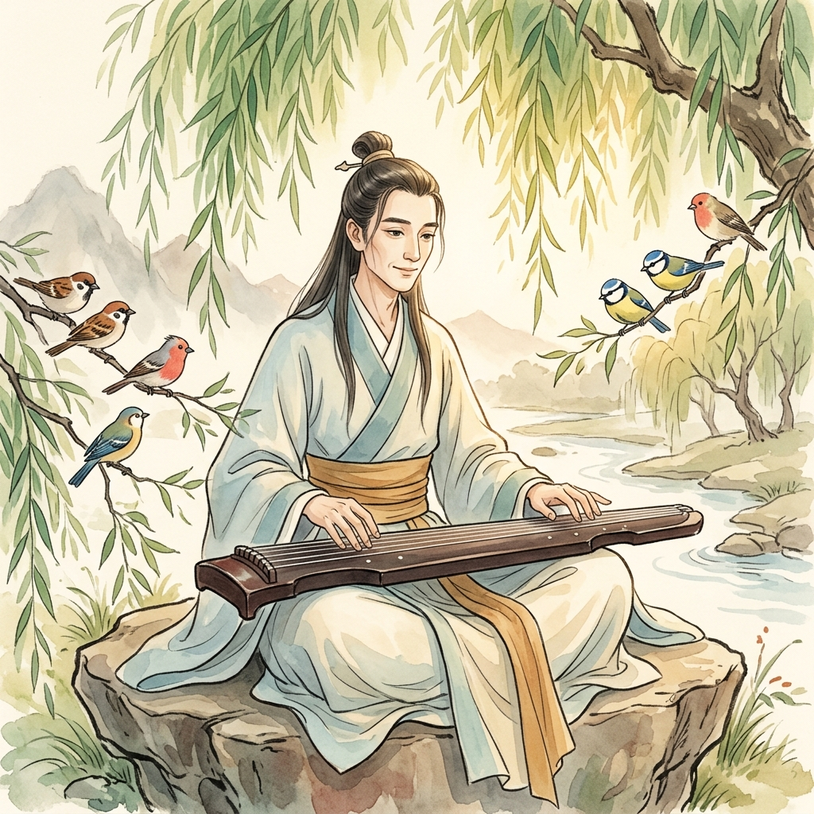
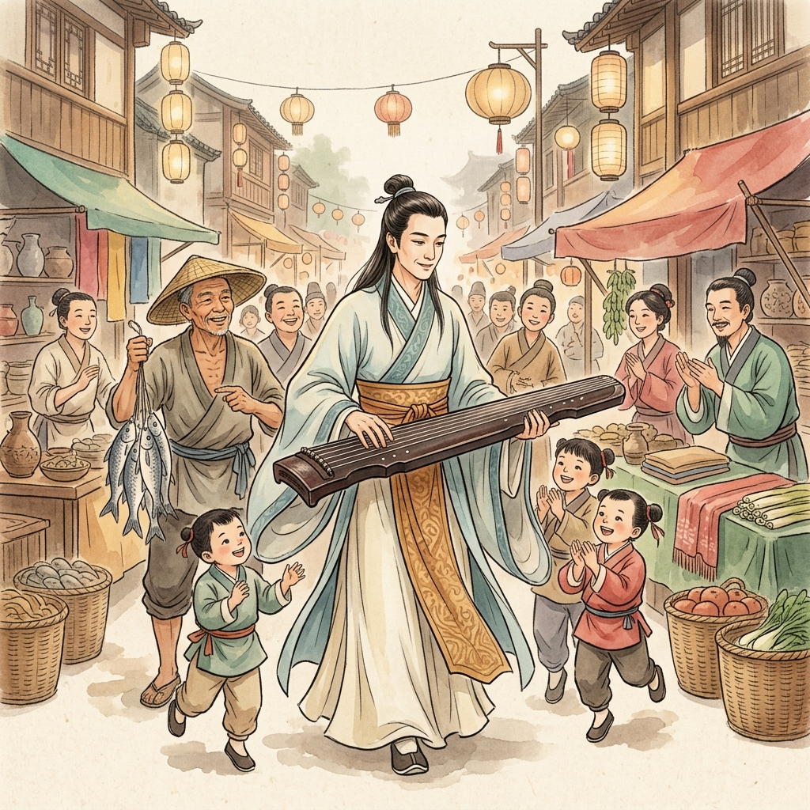
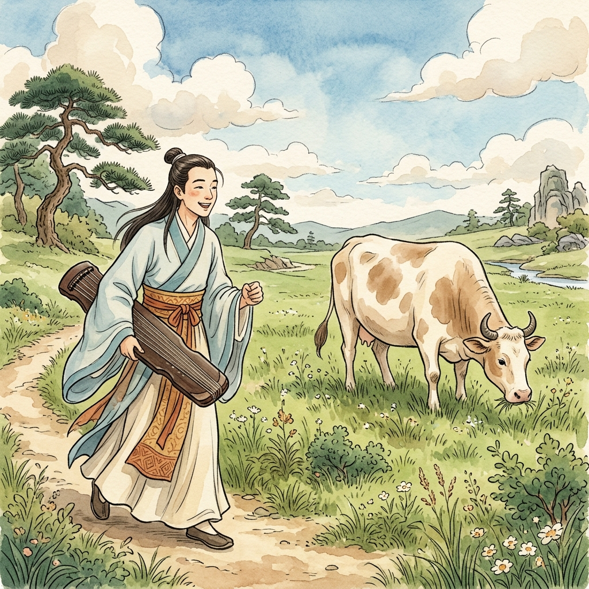
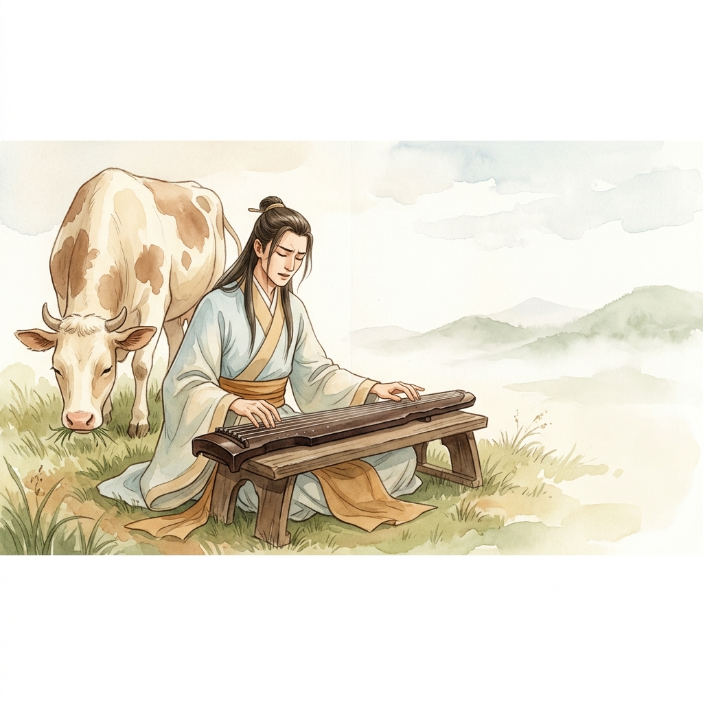
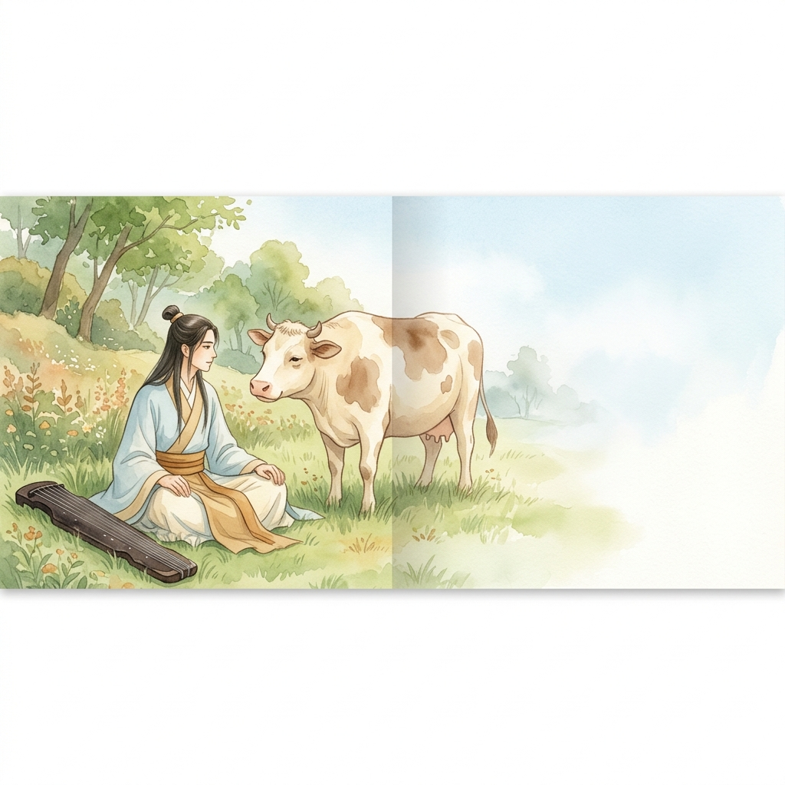
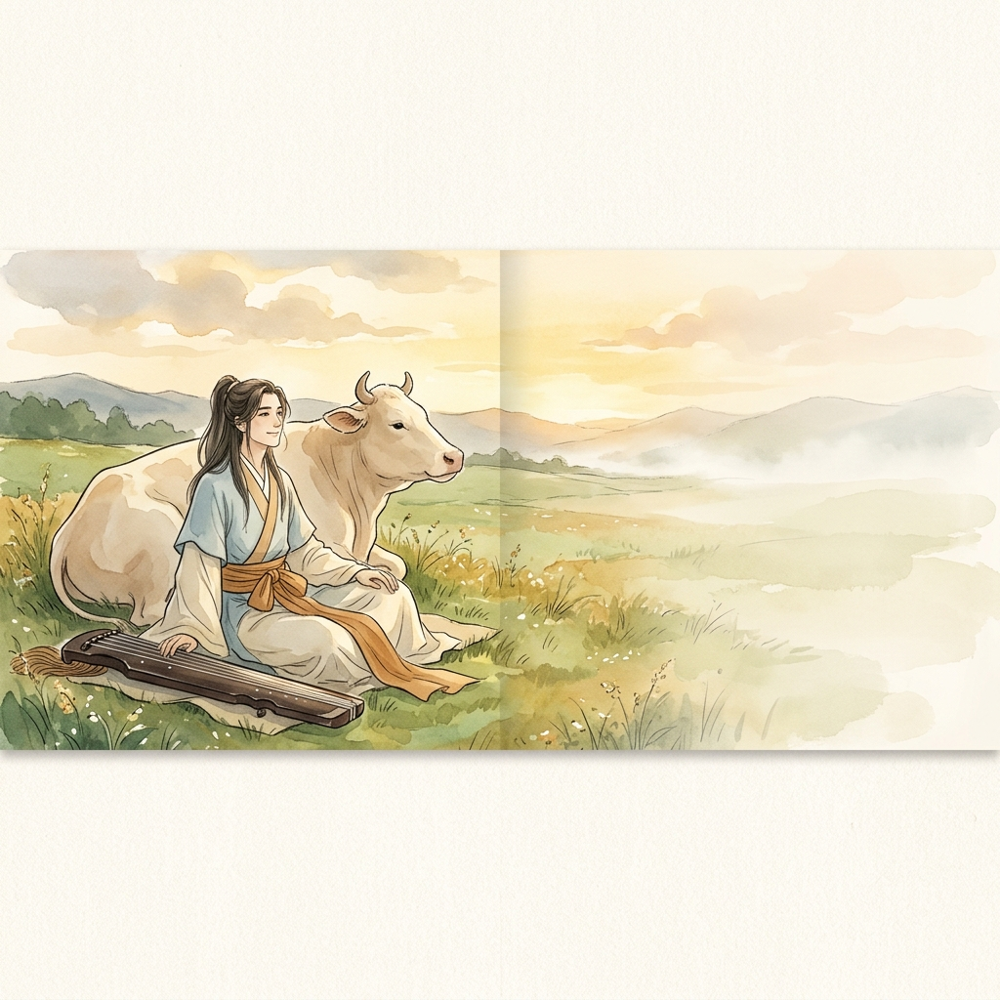

# 对牛弹琴
## Duì Niú Tán Qín — Playing Music to a Cow

*A story about knowing your audience.*

---

## Visual Reference (use in every image prompt, exactly as written)

**Style:** Soft watercolor illustration in traditional Chinese painting style, warm muted palette of cream, jade green, ochre, and soft red, visible gentle brushstrokes, warm lighting, children's picture book art, no text in image.

**Gong Mingyi (the musician):** a slender young musician in his late 20s with long dark hair tied back, a thin kind youthful face, clean-shaven with no beard or mustache, wearing pale blue and cream flowing robes with a wide ochre sash, carrying a dark wooden guqin (seven-string zither).

**The cow:** a large cream-colored cow with soft brown patches, gentle dark eyes, and small curved horns.

> Tip for true visual continuity: generate these in one chat thread and feed the previous image back in as a reference ("using this exact character and art style, now draw...") rather than firing off 6 separate one-shot prompts — locked text descriptions get you close, but a reference image gets you exact.

---

## Title Page / 封面

🎨 **Image prompt (Gemini):**
"A wide, inviting cover scene: Gong Mingyi — a slender young musician in his late 20s with long dark hair tied back, a thin kind youthful face, clean-shaven with no beard or mustache, wearing pale blue and cream flowing robes with a wide ochre sash, carrying a dark wooden guqin (seven-string zither) — walking toward a large cream-colored cow with soft brown patches, gentle dark eyes, and small curved horns, grazing in a sunny green meadow. He looks eager and hopeful, the guqin held ready. Wide open sky, soft morning light, a sense of anticipation. Soft watercolor illustration in traditional Chinese painting style, warm muted palette of cream, jade green, ochre, and soft red, visible gentle brushstrokes, warm lighting, children's picture book art, no text in image."

<!-- Curiosity Gap Option 1: Prediction (Best for younger kids 3–6)
What do you think will happen when the musician plays for the cow? / 当音乐家给牛弹琴时，你觉得会发生什么呢？
-->

<!-- Curiosity Gap Option 2: Mystery (Creates intrigue without revealing anything) -->
A musician is walking toward a grazing cow with his zither... What is about to happen? / 一个音乐家抱着琴朝吃草的牛走去……接下来会发生什么奇怪的事呢？

<!-- Curiosity Gap Option 3: Wisdom Discovery (Reflective): What lesson can we learn from a musician and a cow? / 从音乐家和牛的故事里，我们能学到什么道理呢？ -->

Keep reading to find out! / 继续往下读吧！

---

## Once there was… / 从前…

Once there was a musician named Gong Mingyi. He could play the most beautiful music in the whole land.
When he played his lute, birds would stop to listen, and even the wind grew quiet.

从前，有一个音乐家，名叫公明仪。
他的琴声是全天下最美的。

每当他弹琴，
小鸟会停下来聆听，
连风也变得安静了。

*Cóngqián, yǒu yīgè yīnyuèjiā, míng jiào Gōng Míngyí.*
*Tā de qínshēng shì quán tiānxià zuì měi de.*

*Měi dāng tā tán qín,*
*xiǎoniǎo huì tíng xià lái língtīng,*
*lián fēng yě biàn de ānjìng le.*

🎨 **Image prompt (Gemini):**
"Gong Mingyi (a slender young musician in his late 20s with long dark hair tied back, a thin kind youthful face, clean-shaven with no beard or mustache, wearing pale blue and cream flowing robes with a wide ochre sash, carrying a dark wooden guqin (seven-string zither)) sits cross-legged under a willow tree, playing his dark wooden guqin. Small colorful birds perch on nearby branches with heads tilted, listening intently. Soft golden afternoon light filtering through leaves. Soft watercolor illustration in traditional Chinese painting style, warm muted palette of cream, jade green, ochre, and soft red, visible gentle brushstrokes, warm lighting, children's picture book art, no text in image."

---

## Every day… / 每天…

Every day, Gong Mingyi played his lute for anyone who would listen: fishermen by the river, children playing in the fields, and merchants in the busy market.
Everyone stopped to smile and clap.

每天，公明仪都会为愿意聆听的人弹琴：
河边的渔夫、
田野里玩耍的孩子，
还有热闹集市里的商人。

大家都会停下来微笑、鼓掌。

*Měi tiān, Gōng Míngyí dōu huì wèi yuànyì língtīng de rén tán qín:*
*hé biān de yúfū,*
*tiányě lǐ wánshuǎ de háizi,*
*hái yǒu rènào jíshì lǐ de shāngrén.*

*Dàjiā dōu huì tíng xià lái wēixiào, gǔzhǎng.*

🎨 **Image prompt (Gemini):**
"Gong Mingyi (a slender young musician in his late 20s with long dark hair tied back, a thin kind youthful face, clean-shaven with no beard or mustache, wearing pale blue and cream flowing robes with a wide ochre sash, carrying a dark wooden guqin (seven-string zither)) walking through a bustling ancient Chinese village market, playing his guqin. Fishermen, children, and merchants gather around him, smiling and clapping. Lanterns and market stalls in the background. Soft watercolor illustration in traditional Chinese painting style, warm muted palette of cream, jade green, ochre, and soft red, visible gentle brushstrokes, warm lighting, children's picture book art, no text in image."

---

## Until one day… / 直到有一天…

Until one day, Gong Mingyi walked past a big yellow cow grazing alone in a quiet meadow.
“A new audience!” he thought, his eyes lighting up. He sat down in the grass and began to play his very best song.

直到有一天，公明仪路过一片安静的草地，
看见一头大黄牛正在独自吃草。

“新听众！”他心想，眼睛一亮。

他坐在草地上，
开始弹奏他最拿手的曲子。

*Zhídào yǒu yī tiān, Gōng Míngyí lùguò yí piàn ānjìng de cǎodì,*
*kànjiàn yì tóu dà huángniú zhèngzài dúzì chī cǎo.*

*“Xīn tīngzhòng!” tā xīn xiǎng, yǎnjīng yí liàng.*

*Tā zuò zài cǎodì shàng,*
*kāishǐ tánzòu tā zuì náshǒu de qǔzi.*

🎨 **Image prompt (Gemini):**
"Gong Mingyi (a slender young musician in his late 20s with long dark hair tied back, a thin kind youthful face, clean-shaven with no beard or mustache, wearing pale blue and cream flowing robes with a wide ochre sash, carrying a dark wooden guqin (seven-string zither)) spotting the cow (a large cream-colored cow with soft brown patches, gentle dark eyes, and small curved horns), grazing alone in a green meadow. His face lights up with excitement, his guqin held under one arm. Blue sky with puffy clouds, wide open landscape. Soft watercolor illustration in traditional Chinese painting style, warm muted palette of cream, jade green, ochre, and soft red, visible gentle brushstrokes, warm lighting, children's picture book art, no text in image."

---

## Because of that… / 因此…

Because of that, Gong Mingyi played and played and played. He played fast songs. He played slow songs. He played happy songs, sad songs, and songs about the moon.
But the cow never looked up. It just kept chewing grass (*munch, munch, munch*) and swishing its tail (*swish, swish, swish*).

因此，公明仪弹了又弹，弹了又弹。
他弹奏欢快的曲子，弹奏缓慢的曲子，
弹奏快乐的歌、悲伤的歌，
还有关于月亮的歌。

可是那头牛从来没有抬起头。
它只是继续嚼草（*嚼，嚼，嚼*），
甩着尾巴（*甩，甩，甩*）。

*Yīncǐ, Gōng Míngyí tán le yòu tán, tán le yòu tán.*
*Tā tánzòu huānkuài de qǔzi, tánzòu huǎnmàn de qǔzi,*
*tánzòu kuàilè de gē, bēishāng de gē,*
*hái yǒu guānyú yuèliàng de gē.*

*Kěshì nà tóu niú cónglái méiyǒu tái qǐ tóu.*
*Tā zhǐshì jìxù jiáocǎo (jiáo, jiáo, jiáo),*
*shuǎizhe wěibā (shuǎi, shuǎi, shuǎi).*

🎨 **Image prompt (Gemini):**
"Split illustration showing contrast: on one side, Gong Mingyi (a slender young musician in his late 20s with long dark hair tied back, a thin kind youthful face, clean-shaven with no beard or mustache, wearing pale blue and cream flowing robes with a wide ochre sash, carrying a dark wooden guqin (seven-string zither)) plays his guqin with intense passion, eyes closed, swaying with emotion. On the other side, the cow (a large cream-colored cow with soft brown patches, gentle dark eyes, and small curved horns) chews grass completely unbothered, one eye half-closed, tail casually swishing mid-motion. Slightly comedic contrast between the two. Meadow setting. Soft watercolor illustration in traditional Chinese painting style, warm muted palette of cream, jade green, ochre, and soft red, visible gentle brushstrokes, warm lighting, children's picture book art, no text in image."

---

## Until finally… / 最终…

Until finally, Gong Mingyi set down his lute. He looked at the cow. The cow blinked at him slowly.
And then, he understood.
The cow wasn't being rude. The cow wasn't ignoring him.
The cow simply *could not* understand music at all.

最终，公明仪放下了他的琴。
他看着那头牛。
牛慢慢地眨了眨眼睛看着他。

这时，他终于明白了：
牛不是在无礼，
也不是故意不理他，
而是那头牛根本就听不懂音乐。

*Zuìzhōng, Gōng Míngyí fàngxià le tā de qín.*
*Tā kànzhe nà tóu niú.*
*Niú mànmān de zhǎ le zhǎ yǎnjīng kànzhe tā.*

*Zhè shí, tā zhōngyú míngbái le:*
*Niú búshì zài wúlǐ,*
*yě búshì gùyì bùlǐ tā,*
*érshì nà tóu niú gēnběn jiù tīng bù dǒng yīnyuè.*

🎨 **Image prompt (Gemini):**
"Gong Mingyi — a slender young musician in his late 20s with long dark hair tied back, a thin kind youthful face, clean-shaven with no beard or mustache, wearing pale blue and cream flowing robes with a wide ochre sash, carrying a dark wooden guqin (seven-string zither) — sits in the grass with a look of quiet realization, his dark wooden guqin resting in his lap. A few steps away, The cow — a large cream-colored cow with soft brown patches, gentle dark eyes, and small curved horns — stands chewing grass, looking back at him with soft, empty eyes. The scene is quiet and peaceful, with a gentle breeze rustling the meadow grass. Soft watercolor illustration in traditional Chinese painting style, warm muted palette of cream, jade green, ochre, and soft red, visible gentle brushstrokes, warm lighting, children's picture book art, no text in image."

---

## And ever since then… / 从那以后…

And ever since then, when someone tries very hard to share something they love (their music, their ideas, or their dreams) with someone who simply cannot understand, people smile and say:

**对牛弹琴**
*(duì niú tán qín)*

*Playing music to a cow.*

从那以后，
当有人努力分享自己喜欢的东西，
比如他们的音乐、想法或梦想，
却碰上了一个根本听不懂的人，
大家就会微笑着说：

**对牛弹琴**

*Cóng nà yǐhòu,*
*dāng yǒurén nǔlì fēnxiǎng zìjǐ xǐhuān de dōngxi,*
*bǐrú tāmen de yīnyuè, xiǎngfǎ huò mèngxiǎng,*
*què pèngshàng le yígè gēnběn tīng bù dǒng de rén,*
*dàjiā jiù huì wēixiàozhe shuō：*

*Duì niú tán qín.*

🎨 **Image prompt (Gemini):**
"A quiet, gentle scene at sunset. Gong Mingyi (a slender young musician in his late 20s with long dark hair tied back, a thin kind youthful face, clean-shaven with no beard or mustache, wearing pale blue and cream flowing robes with a wide ochre sash, carrying a dark wooden guqin (seven-string zither)) sits side-by-side with the large cream-colored cow (large cream-colored cow with soft brown patches, gentle dark eyes, and small curved horns) in the peaceful green meadow. Both of them are looking out towards the distant rolling hills under a soft golden sunset sky. His guqin rests gently on the grass, and he has a peaceful smile. Soft watercolor illustration in traditional Chinese painting style, warm muted palette of cream, jade green, ochre, and soft red, visible gentle brushstrokes, warm lighting, children's picture book art, no text in image."

---

## The Idiom / 成语

| | |
|---|---|
| **Characters** | 对牛弹琴 |
| **Pinyin** | duì niú tán qín |
| **Literal meaning** | Playing the lute to a cow |
| **What it means** | Sharing something with the wrong audience — someone who can't appreciate it |

**Use it in a sentence:**
*Talking about your favorite book to someone who never reads is like 对牛弹琴.*
跟一个不爱读书的人谈你最喜欢的书，简直是对牛弹琴。
*(Gēn yī gè bù ài dú shū de rén tán nǐ zuì xǐhuān de shū, jiǎnzhí shì duì niú tán qín.)*

---

## The Story Spine, in 6 Beats

| Beat | What happened |
|---|---|
| **Once there was…** | A musician who played the most beautiful music in the land. |
| **Every day…** | He played for anyone who would listen — and everyone loved it. |
| **Until one day…** | He found a new audience: a cow grazing alone in a meadow. |
| **Because of that…** | He played his very best songs — and the cow just kept chewing grass. |
| **Until finally…** | He understood: the cow wasn't being rude — it simply couldn't understand music. |
| **And ever since then…** | We say 对牛弹琴 — "playing music to a cow" — whenever something is shared with the wrong audience. |